# vrr_agent_open

**Open-source, fully-local VRR Reasoning & Lineage agent — LangGraph + PostgreSQL/pgvector + Unity Catalog OSS + MLflow. No cloud, no cost.**


An open-source port of a Databricks VRR agent. Same trust model — **the LLM never
computes**; every number comes from a deterministic tool with provenance, a
faithfulness gate rejects narration the math doesn't support, recommendations are
physics-computed and safety-clamped, humans approve, and executed outcomes feed a
learned per-pattern response factor ρ — rebuilt on a free local stack.

> **Why this exists:** it shows the *architecture* (deterministic core + agentic
> reasoning + governance + closed-loop learning) is portable off any single vendor.
> The deterministic heart (`core/`) is copied **verbatim** from the Databricks
> version — provider-agnostic Python with its unit tests.

---

## Contents

| | |
|---|---|
| [1. The one idea](#1-the-one-idea-the-llm-never-computes) | where the model is allowed to act |
| [2. System map](#2-system-map) | every component and how they connect |
| [3. Data model](#3-data-model--three-schemas-raw--curated--agent) | three schemas, raw → curated → agent |
| [4. The physics](#4-the-physics--how-a-vrr-number-is-built) | PVT ladder → reservoir volumes → VRR |
| [5. The agent](#5-the-agent--a-real-langgraph-stategraph) | LangGraph StateGraph, node by node |
| [6. Analyst pipeline](#6-the-analyst-pipeline--five-steps-in-this-order) | verify → attribute → classify → propose → draft |
| [7. Faithfulness gate](#7-the-faithfulness-gate--what-actually-blocks-a-wrong-answer) | the three violations it catches |
| [8. RAG](#8-rag--ingest-chunking-retrieval-and-knowing-when-to-abstain) | ingest, measured chunking, abstention |
| [9. Closed loop](#9-the-closed-loop--approval-execution-and-learned-ρ) | approval chain and ρ learning |
| [10. Evaluation](#10-evaluation--prompts-traces-scorers-judges) | prompts, traces, scorers, judges |
| [11. Observability](#11-observability--the-trace-span-tree) | the MLflow span tree |
| [12. Governance](#12-governance--unity-catalog-as-catalog-of-record) | Unity Catalog, honestly |
| [12b. The workbench](#12b-the-workbench--react-over-fastapi) | React over FastAPI, and why the split |
| [12c. API security](#12c-api-security--oauth2-password-grant--jwt-bearer) | OAuth2 + JWT, and what it does not cover |
| [13. Run it](#13-run-it) | every make target |
| [14. Repo layout](#14-repository-layout) | where everything lives |
| [15. Status](#15-status--what-is-real-and-what-is-not) | what is real, what is not |

---

## 1. The one idea: the LLM never computes

Every design decision below follows from one boundary. The model may **choose tools**
and **phrase results**. It may not produce a figure, pick a magnitude, or decide that
an input is trustworthy.

```mermaid
flowchart LR
    subgraph MODEL["🤖 What the LLM may do"]
        direction TB
        M1["pick which tool to call"]
        M2["phrase a computed result"]
        M3["answer general theory, labelled as such"]
    end
    subgraph NEVER["🚫 What it may never do"]
        direction TB
        N1["produce a number"]
        N2["choose a change magnitude"]
        N3["decide inputs are trustworthy"]
        N4["approve or execute anything"]
    end
    subgraph DET["⚙️ Deterministic, provenance-carrying"]
        direction TB
        D1["core/physics.py — PVT + volumes"]
        D2["core/decompose.py — exact LMDI split"]
        D3["core/anomaly.py — detection rules"]
        D4["core/recommend.py — rho + safety clamps"]
        D5["core/audit.py — input verdict"]
        D6["core/approval.py — human chain"]
    end
    MODEL --> GATE{{"core/faithfulness.py GATE"}}
    DET --> GATE
    GATE -->|"verified"| OUT["answer reaches the analyst"]
    GATE -->|"rejected"| FALLBACK["computed attribution shown instead"]
    NEVER -.->|"structurally impossible"| DET

    style MODEL fill:#e8f0fe,stroke:#4285f4
    style NEVER fill:#fce8e6,stroke:#ea4335
    style DET fill:#e6f4ea,stroke:#34a853
    style GATE fill:#fef7e0,stroke:#fbbc04
```

A useful way to read the rest of this document: **every arrow that carries a number
starts in the green box.**

---

## 2. System map

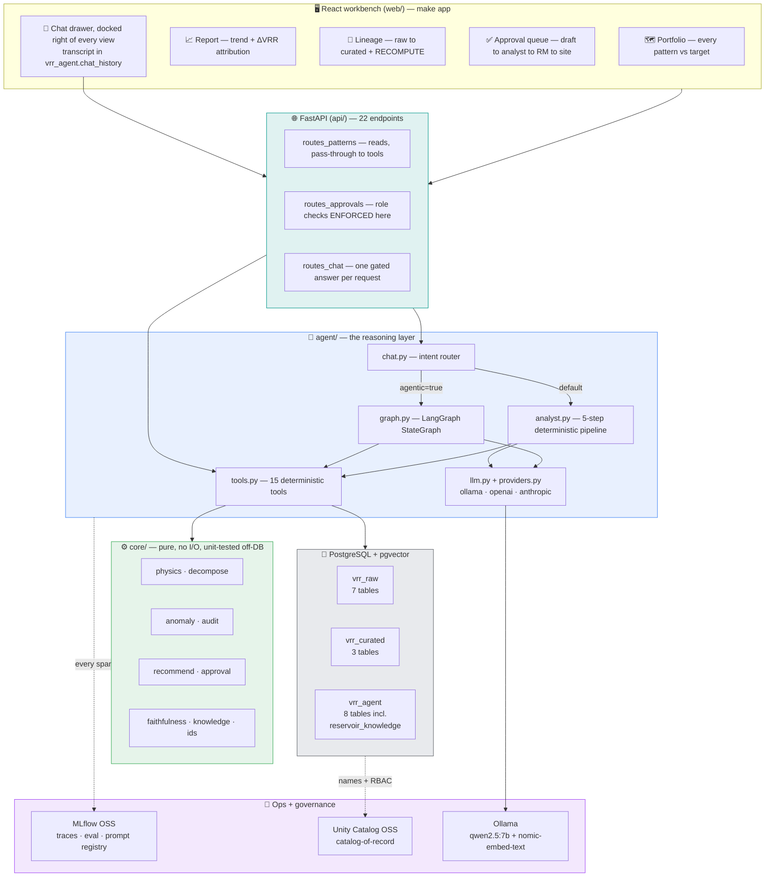

### Stack, and why each piece

| Concern | Tool | Why this one |
|---|---|---|
| Data + compute | **PostgreSQL** | VRR is pure SQL — no Spark needed at this scale |
| Knowledge index | **pgvector** | same DB: one store, one backup, one connection |
| Agent loop | **LangGraph** `StateGraph` | reducers make evidence append-only; the gate is an *edge* |
| Narrator | **Ollama** (`qwen2.5:7b`) | local + free; OpenAI/Anthropic pluggable, billable, off by default |
| Embeddings | **nomic-embed-text** | 768-dim, local, matches the `vector(768)` column |
| Governance | **Unity Catalog OSS** | catalog-of-record (RBAC + lineage) — [not a query engine](#12-governance--unity-catalog-as-catalog-of-record) |
| Tracing / eval / registry | **MLflow OSS** | span trees, scorers, prompt versioning |
| UI | **React + Vite + TypeScript + Tailwind** | 4 views + a docked chat drawer, talking to FastAPI |
| API | **FastAPI** | the same tools over HTTP — and where the approval role checks live |

---

## 3. Data model — three schemas, raw → curated → agent

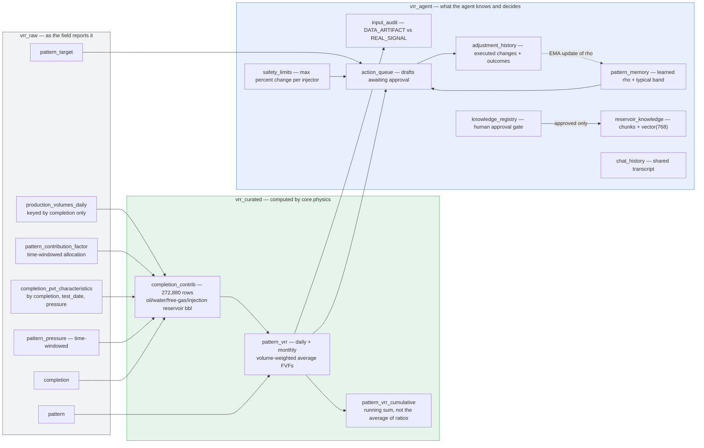

Aligned to the production VRR data model: volumes keyed by **completion only**,
time-windowed allocation and pressure, PVT by `(completion, test_date, pressure)`,
derived `Amount_Type`, a `HAVING` gate, and cumulative VRR as a **running sum of
reservoir volumes** — never the average of monthly ratios. Details and the local
deviations: [docs/vrr_data_model.md](docs/vrr_data_model.md).

---

## 4. The physics — how a VRR number is built

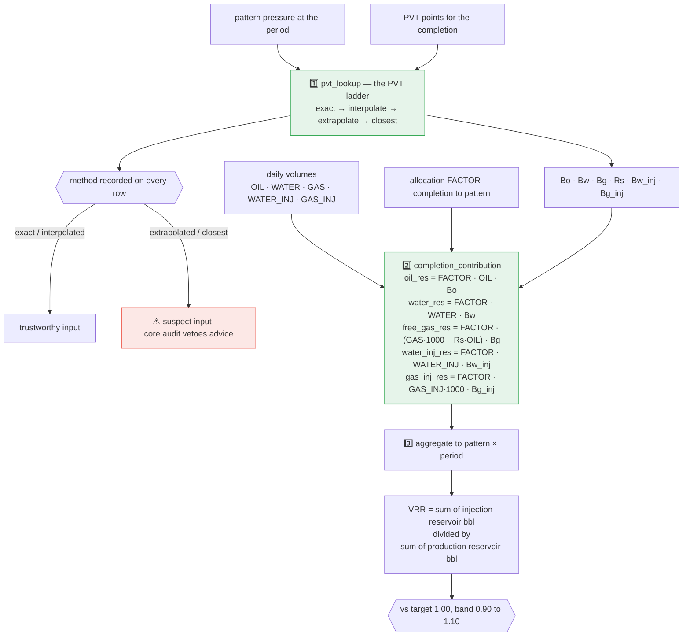

**Why the PVT method is carried all the way through:** a VRR built on an *extrapolated*
lookup is a number with unquantified error. `core/audit.py` turns that into a verdict —
`DATA_ARTIFACT` (fix the inputs, no valve change) vs `REAL_SIGNAL` (diagnose and
recommend) — and the guardrail *never recommend on suspect inputs* is enforced in code,
not in a prompt.

---

## 5. The agent — a real LangGraph `StateGraph`

`agent/graph.py`. Compiled once per process; `build().get_graph().draw_mermaid()`
regenerates this diagram from the code.

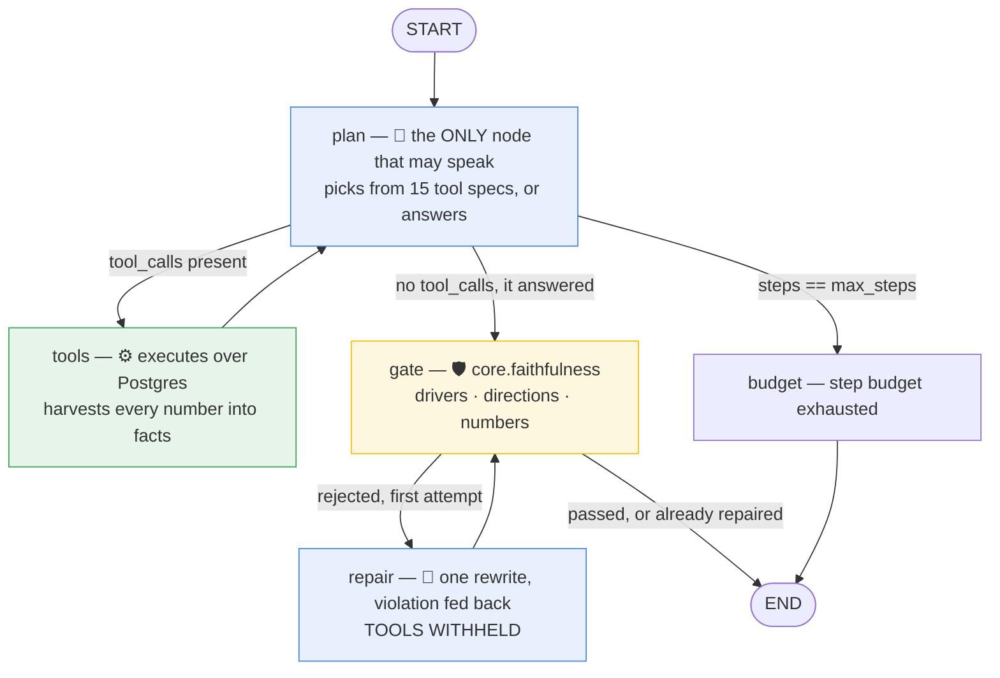

### The state schema is the contract

```python
class State(TypedDict, total=False):
    messages:       Annotated[list[dict],  operator.add]   # append-only
    trace:          Annotated[list[dict],  operator.add]   # append-only  {tool, args, result}
    facts:          Annotated[list[float], operator.add]   # append-only  numbers the answer may cite
    last_decompose: dict | None      # newest VRR_DECOMPOSE — what the gate checks against
    answer: str;  gate: dict;  steps: int;  max_steps: int;  repaired: bool
```

The reducers are the point: a node returns only what it **adds**, so no step can
silently drop evidence the gate is about to check. Five properties fall out:

| Property | Mechanism |
|---|---|
| Evidence cannot be dropped | `operator.add` reducers on `messages`/`trace`/`facts` |
| The gate cannot be bypassed | every path `plan → END` routes through the `gate` node |
| Repaired text is gated too | `repair → gate`, never `repair → END` |
| Runs resume | compiled with `InMemorySaver`; `run(..., thread_id=…)` continues |
| Runaway loops stop | `max_steps` model turns + a `recursion_limit` backstop |

### The 15 deterministic tools

| Group | Tools |
|---|---|
| Discover | `LIST_PATTERNS` · `VRR_OVERVIEW` · `PATTERN_CONTEXT` · `LIST_COMPLETIONS` |
| Measure | `VRR_GET` · `VRR_TREND` · `VRR_DECOMPOSE` |
| Verify | `VRR_AUDIT` (recompute from raw) · `INPUT_AUDIT` · `DATA_QUALITY` · `VRR_LINEAGE` |
| Decide | `DETECT_ANOMALIES` · `RECOMMEND_CHANGE` · `FIND_PRECEDENT` |
| Recall | `SEARCH_KNOWLEDGE` (pgvector, RETRIEVER span) |

A tool error is returned as `{"error": …}` data, never raised — a broken tool must not
crash the loop; it must be something the model can see and route around.

### Two modes, gated identically

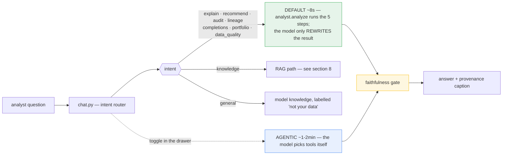

On a local 7B the agentic loop gets caught fabricating figures more often (it likes to
compute daily averages). When it does, the computed answer is shown with the violation
displayed — **the designed outcome, not a failure.**

---

## 6. The analyst pipeline — five steps, in this order

`agent/analyst.py`. The order is the argument: you cannot attribute a number you have
not verified, and you must not recommend on inputs you do not trust.

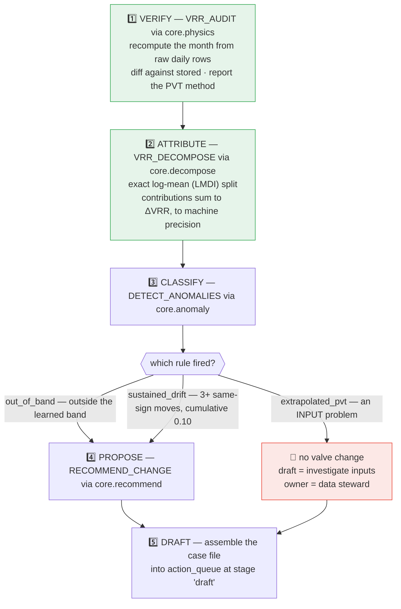

### How a recommendation gets its magnitude

```mermaid
flowchart LR
    A["target VRR minus current VRR"] --> B["1. physics<br/>injection reservoir bbl needed"]
    B --> C["2. precedent calibration<br/>divide by rho, the learned per-pattern gain"]
    C --> D["3. allocate across injectors<br/>by current contribution"]
    D --> E["4. SAFETY CLAMP — each injector limited to<br/>safety_limits.max_inj_rate_change_pct"]
    E --> F["5. expected post-VRR<br/>current + rho · applied / production"]
    F --> G{{"was anything clamped?"}}
    G -->|"yes"| H["note: clamped by safety limits —<br/>expected VRR will not fully reach target"]

    style E fill:#fce8e6,stroke:#ea4335
    style C fill:#e6f4ea,stroke:#34a853
```

The model never picks the number **and never sees a path where it could** — step 4 is a
`min`/`max` in Python against a row in `vrr_agent.safety_limits`.

---

## 7. The faithfulness gate — what actually blocks a wrong answer

`core/faithfulness.py`. Pure, no second model, no I/O — it checks narration against the
decomposition that produced it.

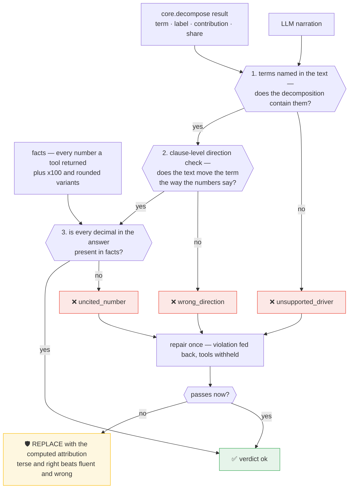

Two details that took real work:

- **Clause-level, not sentence-level.** *"water injection fell, pushing VRR up"* carries
  two opposite direction words; only the first is a claim *about the term*.
- **Listing is not claiming.** "gas injection contributed 0.0%" is fine; calling a 0.0%
  term *the driver* is not. `DRIVER_CLAIMS` phrases ("driven by", "main", "responsible
  for") turn a mention into a claim, and only terms above a 10% share may carry one.

Real output from a live run:

```
⚠️ The narration was rejected by the faithfulness gate.
Computed attribution:
- water production: +0.0294 VRR (59.6% of the move)
- oil production:   +0.0130 VRR (26.3% of the move)
- water injection:  -0.0069 VRR (14.1% of the move)
[gate: uncited_numbers: [3.36] | retried: True]
```

The model cited **3.36** — a number no tool returned. Caught, retried, replaced.

---

## 8. RAG — ingest, chunking, retrieval, and knowing when to abstain

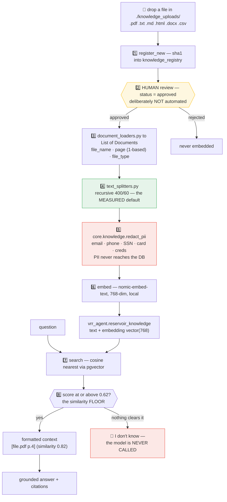

### Chunking is judged by retrieval, never by eye

Each chunk is embedded in **isolation** — context lost at a boundary is unrecoverable at
query time. So the test is retrieval, not appearance (`make chunks`):

| Strategy | chunks | ends on a sentence | recall@2 | MRR |
|---|---|---|---|---|
| fixed (200 chars) | 4 | 25% | 0.33 | 0.56 |
| **recursive (400/60)** ← default | 3 | 100% | **1.00** | **1.00** |
| semantic (cosine 0.75) | 9 | 100% | 0.67 | 0.78 |

Fixed splitting cuts `"…the response factor rho … It starts │ at 0.85…"`; the question
*"what does rho start at?"* then ranks the chunk holding `0.85` **third** — outside the
top-k that reaches the prompt.

**Semantic chunking is not automatically better.** On short, dense procedure text it
over-splits (83-char chunks carry too little context to rank). That finding is exactly
why the measurement exists.

Diagnosing a failing probe:

| Symptom | Cause | Fix |
|---|---|---|
| recall high, MRR low | chunks too big, answer buried | smaller chunks / more overlap |
| fails at one chunk size | a boundary cuts the rule | recursive, or raise overlap |
| **fails at every size** | vocabulary mismatch | query expansion / hybrid search |
| off-topic scores like answerable | wrong embedder for the domain | `make floor` shows a gap ≤ 0 |

### The floor is measured, not guessed

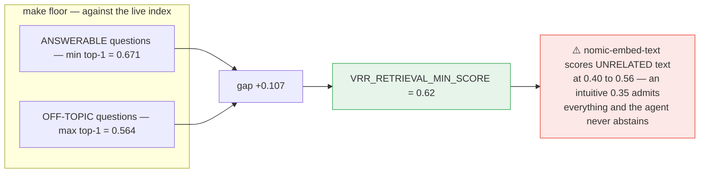

A **negative** gap means no threshold separates the sets — that is a retrieval problem
(chunking, embedder), not a tuning problem. `rulebook_unanswerable` in the eval set
guards the abstain path: without a negative case, a retriever that always returns its k
nearest rows scores identically to one that knows when it has nothing.

---

## 9. The closed loop — approval, execution, and learned ρ

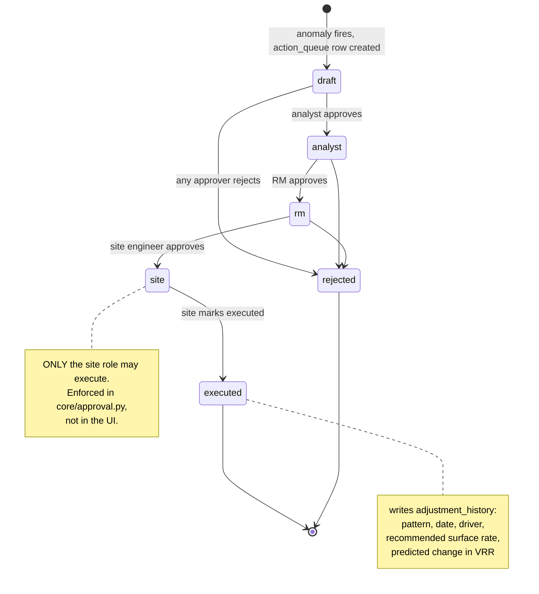

Then the loop closes:

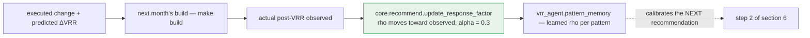

> **Honest status:** the write-back of `actual_post_vrr` and the EMA update are the top
> open task — `core.recommend.update_response_factor` exists and is unit-tested, but the
> pipeline job that feeds it observed outcomes is not wired yet.

---

## 10. Evaluation — prompts, traces, scorers, judges

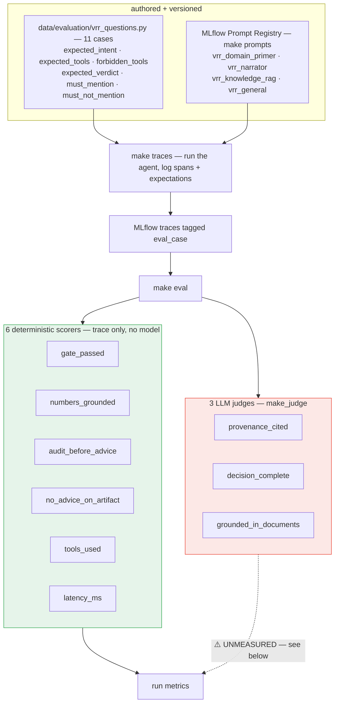

### The scorers, and what each one catches

| Scorer | Fails when | Latest run |
|---|---|---|
| `gate_passed` | any span records a faithfulness rejection | 1.00 |
| `numbers_grounded` | a decimal in the answer appears in no tool span | 0.98 |
| `audit_before_advice` | a recommendation is issued before an input audit | 1.00 |
| `no_advice_on_artifact` | a change is proposed on a `DATA_ARTIFACT` verdict | 1.00 |
| `tools_used` | *(diagnostic)* zero means the model spoke alone | mean 4.34 |
| `latency_ms` | *(diagnostic)* quality gains that cost 10× stay visible | mean 1.12 s |

### The case set — 11 cases, including the negative ones

| Case | Guards |
|---|---|
| `explain_out_of_band` | the core verify → attribute → propose path |
| `audit_clean_number` | an audit question must not turn into advice |
| `suspect_inputs_no_advice` | **no recommendation on a `DATA_ARTIFACT` verdict** |
| `healthy_pattern_no_action` | a healthy pattern gets no change proposed |
| `lineage_derivation` · `completions_listing` · `portfolio_triage` · `data_quality_check` | routing + tool selection |
| `rulebook_step_limit` | RAG grounding: the answer stays inside the retrieved excerpts |
| `rulebook_unanswerable` | **the agent must ABSTAIN** |
| `general_concept` | theory answered, and labelled "not your data" |

### ⚠️ The judges are not usable yet — stated plainly

`make_judge(base_url=…)` was pointed at `{ollama}/v1`, but MLflow **POSTs to that URL
verbatim** instead of appending `/chat/completions`. Every judge died on a silent `404`,
so `make eval` reported 6 scorers, exited 0, and looked green while `get_scorers()`
claimed 9. The endpoint is fixed and they now execute — but they score ~0.02 with
rationales reading *"Not enough information provided"*, meaning the trace content is not
reaching the judge. Treat `provenance_cited` / `decision_complete` /
`grounded_in_documents` as **unmeasured**.

> **Repo rule:** where a judge and a deterministic scorer disagree, **the deterministic
> one is right.** `numbers_grounded` scores 0.98 over the same traces the judges score
> 0.02.

> **Evaluation rule:** always `make traces` immediately before `make eval`, and only via
> the Makefile — `make eval` passes `--eval-only`, which filters `tags.eval_case != ''`.
> Running the script bare scores the last 50 traces of *any* origin, so the `*/mean`
> denominators shift and two runs stop being comparable.

---

## 11. Observability — the trace span tree

Every question is a span tree in MLflow. Span **types** matter: a `RETRIEVER` span
carrying `mlflow.entities.Document`s is what makes retrieval scorable at all — the same
content in a `TOOL` span is invisible to the retrieval scorers.

```
chat.respond ······················ AGENT
├── agent.tool_loop ··············· AGENT      (agentic mode only)
│   ├── node.plan ················· LLM        ← the model's turn
│   ├── node.tools ················ CHAIN
│   │   ├── tool_call VRR_AUDIT ··· TOOL       ← recompute from raw
│   │   └── tool_call VRR_DECOMPOSE TOOL       ← LMDI attribution
│   ├── node.plan ················· LLM
│   ├── node.gate ················· CHAIN      ← faithfulness verdict
│   └── node.repair ··············· LLM        (only when the gate rejects)
├── llm.chat ······················ LLM        (default mode: rewrite only)
├── search_knowledge ·············· RETRIEVER  ← Documents, not a dict
└── faithfulness_gate ············· CHAIN
```

Tool spans are recorded **structured and untruncated** — a truncated payload silently
breaks every grounding check that reads the trace, which is a bug this repo has already
had once.

---

## 12. Governance — Unity Catalog as catalog-of-record

Unity Catalog OSS is a **catalog**, not a query engine. It governs registered assets
(RBAC + lineage + credential vending) but does **not** intercept live PostgreSQL queries
in OSS — Lakehouse Federation is Databricks-only.

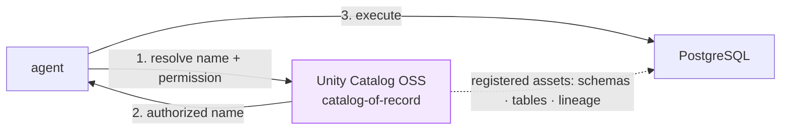

So the enforcement boundary is the agent, not the database. Full reasoning and the
alternative all-Delta design: [docs/design.md](docs/design.md).

---

## 12b. The workbench — React over FastAPI

Streamlit was retired in favour of a real client/server split. The reason is not
cosmetic: in the Streamlit version the approval role check was *hiding a button*, which
is UX, not a control. Now the client asks and the **server decides**.

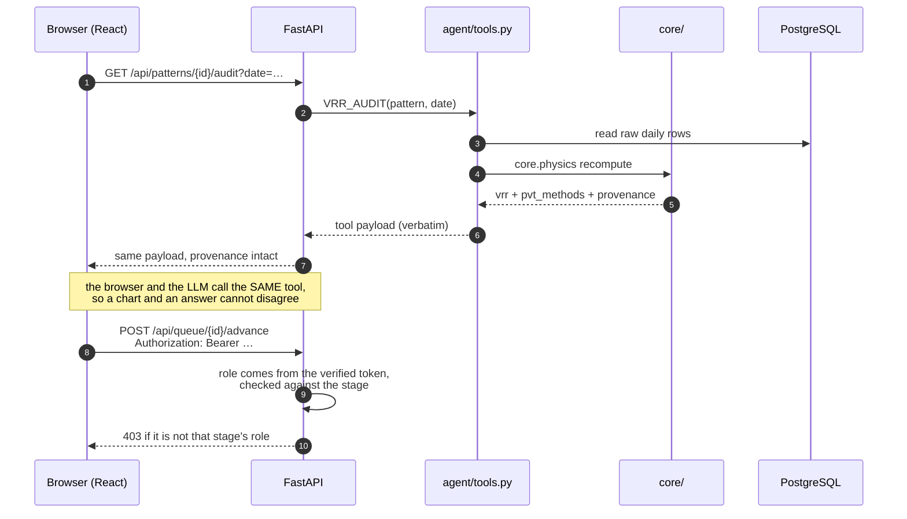

**The endpoints** (full OpenAPI at `:8000/docs`):

| Group | Endpoints |
|---|---|
| Reads | `/patterns` · `/overview` · `/data-quality` · `/input-audit` · `/patterns/{id}/context` `/trend` `/decompose` `/audit` `/lineage` `/completions` `/analysis` |
| Writes | `/patterns/{id}/submit` · `/queue/{id}/advance` · `/queue/{id}/reject` |
| Chat | `POST /chat` · `GET /chat/history` |
| System | `/health` · `/stages` · `/queue` · `/adjustments` |

**Three rules this layer holds:**

1. **No endpoint computes.** Reads are pass-throughs to `agent/tools.py`, provenance keys
   and all. A test asserts the payload comes back *verbatim* — the moment the API
   reshapes a tool result, the number on screen stops being the number the tool produced.
2. **Guardrails are server-side.** Role checks, terminal-stage refusals and the
   adjustment-history write all live in `routes_approvals.py`, and the role they check
   is the one in the caller's verified token — see [§12c](#12c-authentication--oauth2-password-grant--jwt-bearer).
3. **`adjustment_history` is written before the stage moves.** An executed item with no
   history row would silently never be learned from by the ρ loop.

**Why plain JSON and not token streaming:** `core.faithfulness` can only verify a
*finished* answer. Streaming tokens would mean streaming text the gate has not approved
and may replace. Streaming *progress events* (which tool is running) is the sane future
addition; streaming the narration is not.

The React side is deliberately thin — `web/src/api.ts` is the only place it speaks HTTP,
and no view does arithmetic. It renders what the tools computed, plus the provenance
caption under every answer:

```
Computed from your tables · qwen2.5:7b phrasing · ✅ gate passed after one repair
▸ Evidence & provenance
```

---

## 12c. Authentication — OAuth2 password grant + JWT bearer

The approval chain is a chain of *people*: a draft moves analyst → RM → site, and only
the site engineer may execute. That only means something if the server — not the client
— decides who you are. So **identity is a signed token claim**, established at login and
verified on every protected call.

### Signing in

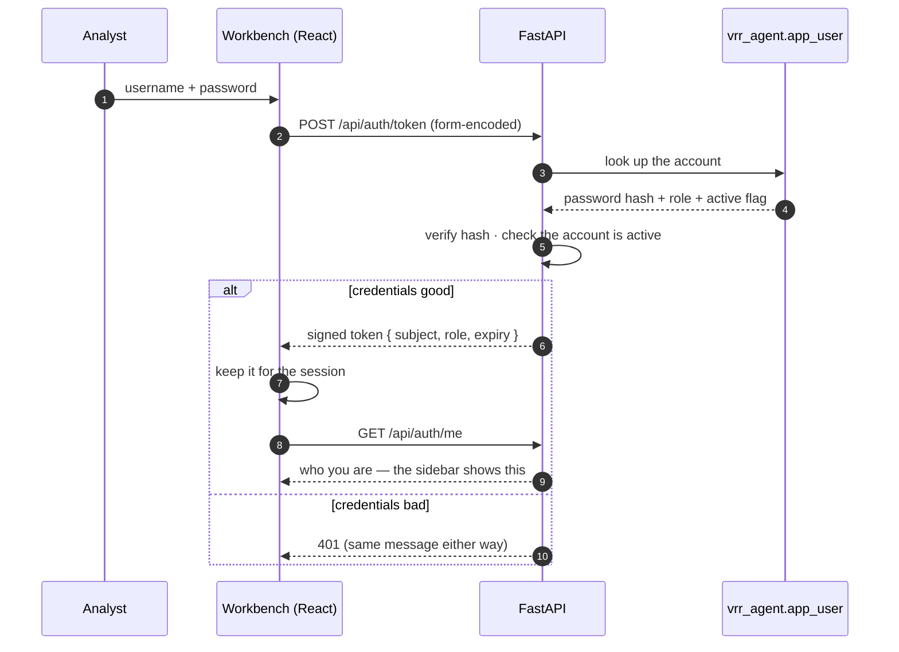

The failure message is identical whether the account does not exist or the password is
wrong: a login that distinguishes them tells a stranger which usernames are real.

### Making a request

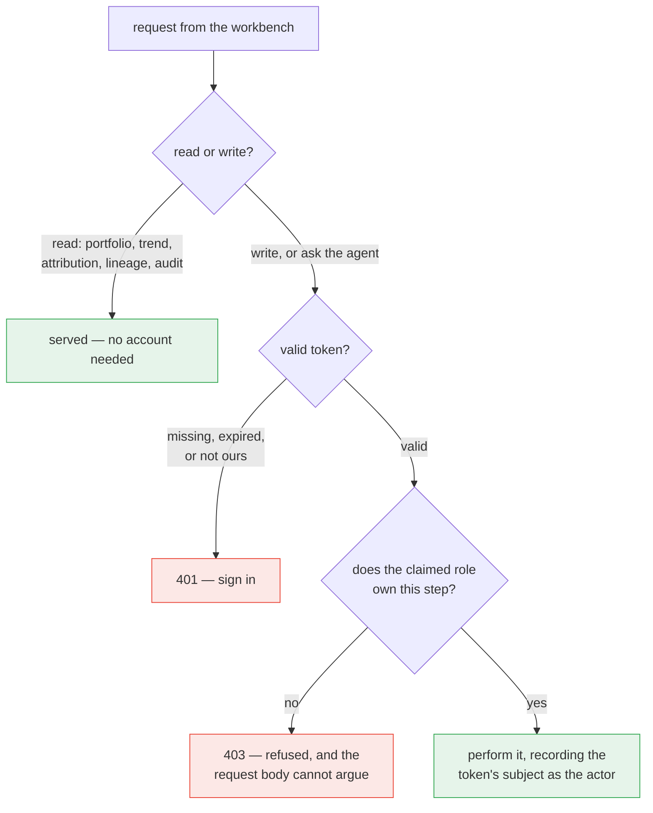

Two things fall out of that shape:

- **The role is never read from the request.** It is a claim inside the token, checked
  against the stage the item currently sits at. Hiding a button in the UI is convenience;
  the refusal is the control.
- **The actor on the audit trail is the token's subject.** `action_queue.stage_by` and
  `adjustment_history.approved_by` record who the server authenticated — the ρ learning
  loop and any later review read a name that was proven, not typed.

### What needs an account

| | Needs a token | Why |
|---|---|---|
| Portfolio, trend, attribution, lineage, audit, health | no | reading is how you evaluate the tool; a fresh clone should just work |
| Ask the agent (`/chat`) | **yes** | it spends real compute |
| Draft a change, advance, reject | **yes** | these move a valve change toward execution |

### Roles

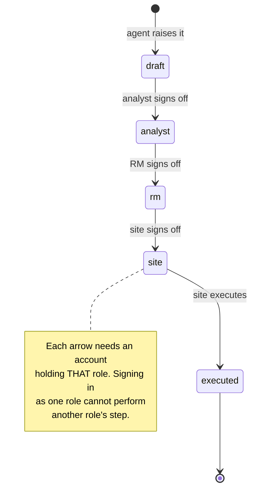

### Setting it up

```bash
make users                          # creates the account table and seeds one demo
                                    # account per role, with hashed passwords
make users p=<your-password>        # …choosing the password instead of the default
```

Set a signing key in `.env` before real use — without one the API generates a throwaway
key per process, so sessions end at every restart and it says so loudly at startup:

```bash
python3 -c "import secrets; print(secrets.token_urlsafe(48))"   # → VRR_JWT_SECRET in .env
```

`.env` is gitignored. No credential or key is committed, and none has a default baked
into the source — a well-known signing key in a public repo would look like security
while providing none.

### Before exposing this beyond localhost

The defaults suit a workbench you run on your own machine. Moving it anywhere shared is
a deliberate step with a checklist, not a copy of this configuration:

1. **Change the seeded accounts** — `make users p=…`, or create real ones and remove the
   demos. Treat the shipped defaults as placeholders, not accounts.
2. **Set `VRR_JWT_SECRET`** to a value generated as above, hold it like a password, and
   rotate it if it is ever shared. Rotating invalidates existing sessions by design.
3. **Terminate TLS in front of the API.** Bearer tokens over plain HTTP are readable in
   transit; nothing in the application layer compensates for that.
4. **Shorten `VRR_JWT_TTL_MINUTES`** from the 12-hour default to match how long a session
   should reasonably live, since sessions end by expiry rather than by revocation.
5. **Decide where the token lives.** The browser build keeps it in web storage, which is
   the usual trade for a single-page app; a deployment with stricter requirements should
   move it to an httpOnly cookie and add CSRF protection.
6. **Point at your identity provider** if you have one. The verification step is one
   function — `current_user` in `api/auth.py` — and swapping local signing for an IdP's
   published keys changes nothing downstream of it.

`tests/test_auth.py` covers this layer as a set of adversarial cases — tampered tokens,
expired tokens, missing claims, and a caller trying to act above its role — so a
regression in any of them fails the suite rather than reaching a review.

---

## 13. Run it

```bash
# ---- fast path: logic only, nothing running ---------------------------------
pip install -e ".[dev]"     # installable package + pytest/ruff
pytest -q                   # 129 tests, no Postgres, no Ollama, ~5 s

# ---- the stack --------------------------------------------------------------
docker compose up -d        # postgres+pgvector · unitycatalog · mlflow
make seed                   # synthetic VRR data; core.physics computes curated
make build                  # rebuild vrr_curated from vrr_raw alone
make queue                  # anomaly → action_queue drafts awaiting approval
make users                  # seed the demo accounts (analyst/rm/site) — writes need a token
make app                    # build the React UI and serve it from FastAPI on :8000

# ---- developing the UI ------------------------------------------------------
make api                    # FastAPI with --reload; OpenAPI docs at :8000/docs
make web                    # Vite dev server on :5173, proxying /api to :8000

# ---- knowledge / RAG --------------------------------------------------------
make knowledge              # register → (human approves) → load → chunk → embed
make loaders                # what a folder/URL parses into, before embedding it
make chunks                 # score chunking strategies by retrieval (recall@k, MRR)
make floor                  # measure the abstention threshold for YOUR corpus

# ---- the model --------------------------------------------------------------
make llm-check              # can each provider complete AND tool-call?
make agent                  # one question from the CLI, through the graph

# ---- evaluation (always in this order) --------------------------------------
make prompts                # version the 4 prompts in the MLflow registry
make traces                 # run the 11 eval cases, logging spans + expectations
make eval                   # score them (deterministic + judges if a model is up)
```

Every command commented step-by-step: [docs/running.md](docs/running.md).
Config lives in `.env` — copy [.env.example](.env.example), which documents every knob.

---

## 14. Repository layout

```
vrr_agent_open/
├── docker-compose.yml          # postgres+pgvector · unitycatalog · mlflow
├── Makefile                    # every target above; auto-selects .venv/bin/python
├── .env.example                # every setting, commented (keys live in .env only)
├── src/vrr_agent_open/
│   ├── config.py               # DSN · UC · MLflow · provider · embeddings · RAG floor
│   ├── core/                   # ⚙️ PURE logic — no I/O, unit-tested off-DB
│   │   ├── physics.py          #    PVT ladder + reservoir volumes
│   │   ├── decompose.py        #    exact LMDI ΔVRR attribution
│   │   ├── anomaly.py          #    out_of_band · sustained_drift · extrapolated_pvt
│   │   ├── recommend.py        #    rho-calibrated, safety-clamped change + EMA update
│   │   ├── audit.py            #    DATA_ARTIFACT vs REAL_SIGNAL verdict
│   │   ├── faithfulness.py     #    the gate: drivers · directions · numbers
│   │   ├── approval.py         #    draft → analyst → rm → site → executed
│   │   ├── knowledge.py        #    chunking + PII redaction
│   │   └── ids.py              #    stable short ids for provenance
│   ├── agent/
│   │   ├── graph.py            # 🧠 LangGraph StateGraph (plan/tools/gate/repair/budget)
│   │   ├── tools.py            #    15 deterministic tools over psycopg
│   │   ├── analyst.py          #    the 5-step pipeline
│   │   ├── chat.py             #    intent router + RAG + the abstain path
│   │   ├── llm.py              #    one call shape for every backend
│   │   ├── providers.py        #    ollama · openai · anthropic translation
│   │   ├── history.py          #    shared chat transcript in Postgres
│   │   └── tracing.py          #    MLflow spans (TOOL · LLM · CHAIN · RETRIEVER)
│   ├── pipeline/
│   │   ├── schema.sql          #    the three-schema DDL (+ pgvector)
│   │   ├── seed.py             #    deterministic synthetic field generator
│   │   ├── build.py            #    vrr_raw → vrr_curated via core.physics
│   │   ├── input_audit.py      #    the audit gate as a batch job
│   │   ├── anomaly_to_queue.py #    anomalies → action_queue drafts
│   │   ├── knowledge_ingest.py #    register → approve → load → chunk → embed → search
│   │   ├── document_loaders.py #    pdf/txt/md/html/docx/csv/folder/URL → Documents
│   │   └── text_splitters.py   #    fixed vs recursive vs semantic + retrieval_check
│   ├── evaluation/             # 6 deterministic scorers + 3 judges
│   ├── prompts/templates.py    # the 4 versioned prompts
│   ├── api/                    # 🌐 FastAPI — the workbench backend
│   │   ├── main.py             #    app, CORS, health, serves web/dist in prod
│   │   ├── routes_patterns.py  #    reads: overview · trend · decompose · audit · lineage
│   │   ├── routes_approvals.py #    the chain — ROLE CHECKS ENFORCED SERVER-SIDE
│   │   └── routes_chat.py      #    one gated answer per request + the transcript
│   └── governance/uc_register.py
├── web/                        # ⚛️ React + Vite + TypeScript + Tailwind
│   ├── src/api.ts              #    the typed client — the only place it calls HTTP
│   ├── src/App.tsx             #    shell: sidebar filters + view routing
│   ├── src/views/              #    Portfolio · Report · Lineage · Approval
│   └── src/components/         #    ChatDrawer + shared primitives
├── data/evaluation/            # the 11 authored cases + their expectations
├── scripts/                    # traces · eval · prompts · judges · floor · llm-check
├── tests/                      # 129 tests, all off-DB
└── docs/                       # design · running · agent-flow · knowledge-flow ·
                                # evaluation · evaluation-walkthrough · vrr_data_model
```

---

## 15. Status — what is real, and what is not

| Area | State |
|---|---|
| Deterministic core (`core/`) | ✅ ported verbatim, 129 tests, no stack needed |
| Postgres schema + seed + build | ✅ verified end to end (272,880 contrib → 1,440 monthly rows) |
| LangGraph agent + 15 tools | ✅ a real `StateGraph`; every path tested with the model stubbed |
| Faithfulness gate | ✅ catches wrong drivers, wrong directions, uncited numbers |
| React workbench + FastAPI | ✅ 4 views, docked chat, login, **roles from signed JWT claims** (403/401-verified live) |
| RAG (load → chunk → embed → search) | ✅ 4 docs / 35 chunks ingested; chunking + floor both **measured** |
| Abstention ("I don't know") | ✅ floor 0.62, model not called, guarded by an eval case |
| Providers (Ollama / OpenAI / Anthropic) | 🔶 local verified; **hosted unverified — no API key on the dev machine** |
| Evaluation harness | ✅ 6 deterministic scorers over 11 cases |
| The 3 LLM judges | 🔶 **execute but unusable** — trace content is not reaching them |
| ρ write-back loop | 🔶 `update_response_factor` exists + tested; the outcome job is not wired |
| Unity Catalog registration | 🔶 skeleton; column population from `information_schema` is a TODO |
| Docker compose path | 🔶 verified against a local Postgres 18, not yet the compose stack |

Contributions welcome — Apache-2.0.
