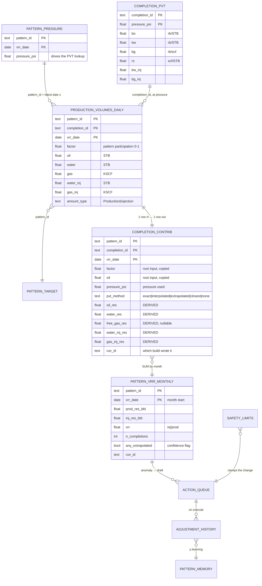

# Data model — how a VRR number is built

Three Postgres schemas, one direction of travel: **raw → curated → agent**. Nothing
downstream invents a number; every derived value is computed by
[`core/physics.py`](../src/vrr_agent_open/core/physics.py) and stored with the inputs it
came from. DDL: [`pipeline/schema.sql`](../src/vrr_agent_open/pipeline/schema.sql).



## Grain — the thing to get right

| Table | Grain (one row =) | Why |
|---|---|---|
| `vrr_raw.production_volumes_daily` | pattern · completion · **day** | source-shaped; a completion can serve several patterns, hence `factor` |
| `vrr_raw.pattern_pressure` | pattern · date | resolved as *latest reading on or before* the production date — no interpolation across readings |
| `vrr_raw.completion_pvt` | completion · **pressure point** | a lab test curve, not a time series |
| `vrr_curated.completion_contrib` | pattern · completion · **day** | the lineage layer — same grain as raw, plus derived terms |
| `vrr_curated.pattern_vrr_monthly` | pattern · **month** | what the app and the tools read |
| `vrr_agent.action_queue` | one draft recommendation | agent writes `draft`; humans move it |
| `vrr_agent.adjustment_history` | one executed change | predicted vs actual ΔVRR → ρ |

## The calculation, in order

**1 · Resolve pressure.** For each raw daily row, take the pattern's latest
`pressure_psi` on or before `vrr_date`.

**2 · Look up PVT at that pressure** (`core.physics.pvt_lookup`) from the completion's
test points, and record **how** it was obtained:

| method | meaning | confidence |
|---|---|---|
| `exact` | a test point sits at that pressure | ✅ |
| `interpolated` | linear between the nearest lower/upper points | ✅ |
| `extrapolated` | outside the tested range, 2-point linear extrapolation | ⚠️ suspect inputs |
| `closest` | only one point on one side | ⚠️ suspect inputs |
| `none` | no PVT for the completion | ⚠️ terms are null |

**3 · Compute the five reservoir-volume terms** (`core.physics.completion_contribution`)
and write one `completion_contrib` row per raw row, carrying the inputs *and* the
outputs *and* `pvt_method`:

```
oil_res       = FACTOR · OIL                 · Bo
water_res     = FACTOR · WATER               · Bw
free_gas_res  = FACTOR · (GAS·1000 − Rs·OIL) · Bg      ← producers with OIL>0 only; may be < 0
water_inj_res = FACTOR · WATER_INJ           · Bw_inj
gas_inj_res   = FACTOR · GAS_INJ·1000        · Bg_inj
```

`free_gas_res` is free gas: surface gas minus the gas that was dissolved in the produced
oil (`Rs·OIL`). It is NULL — not 0 — for non-producing rows, and excluded from the sum.

**4 · Aggregate to month:**

```sql
prod_res_bbl = Σ (oil_res + water_res + COALESCE(free_gas_res, 0))
inj_res_bbl  = Σ (water_inj_res + gas_inj_res)
vrr          = inj_res_bbl / NULLIF(prod_res_bbl, 0)     -- NULL, not 0, when undefined
any_extrapolated = BOOL_OR(pvt_method IN ('extrapolated','closest','none'))
```

## Worked example (real row from the seeded field)

`PAT-001-P1`, 2026-07-01, pattern pressure **3074.5 psi**. Its PVT points are at 2600 /
2900 / 3200 / 3500 psi → 3074.5 falls between 2900 and 3200, so
`pvt_method = interpolated`, giving Bo ≈ 1.2253, Bw = 1.0389, Bg ≈ 0.00075, Rs ≈ 572.7.

| input | value | term | result |
|---|---|---|---|
| FACTOR | 0.84 | | |
| OIL | 227.02 STB | `oil_res` = 0.84 · 227.02 · 1.2253 | **233.7** rb |
| WATER | 677.72 STB | `water_res` = 0.84 · 677.72 · 1.0389 | **591.4** rb |
| GAS | 92.52 KSCF | `free_gas_res` = 0.84 · (92 520 − 572.7·227.02) · 0.00075 | **−22.9** rb |

The negative free gas is correct and meaningful: this completion produced *less* gas
than the oil's dissolved-gas content implies, so the free-gas term subtracts. Summed
across UNITY's five completions for that month: prod 57,104 rb, inj 83,667 rb → **VRR
1.465**.

## Confidence and governance columns

* `pvt_method` (row level) → `any_extrapolated` (month level) is the **confidence flag**
  that vetoes valve recommendations (`core.anomaly` rule 1).
* `run_id` on both curated tables says which build produced the number; `make build`
  stamps a new one.
* `vrr_agent.pattern_memory` holds the pattern's learned band and response factor ρ;
  `safety_limits` caps any recommended change; `adjustment_history` closes the loop with
  predicted vs actual ΔVRR.
* Unity Catalog OSS registers these tables as the catalog-of-record (table-level lineage
  + RBAC); row-level derivation lives in `completion_contrib`.

## Reading it back

| Question | Tool | Table |
|---|---|---|
| what is VRR for a pattern/period | `VRR_GET`, `VRR_TREND` | `pattern_vrr_monthly` |
| which completions make it up | `LIST_COMPLETIONS` | `completion_contrib` |
| how was this number derived | `VRR_LINEAGE` | contrib + raw + PVT |
| is it actually right | `VRR_AUDIT` | recomputes from raw |
| why did it move | `VRR_DECOMPOSE` | contrib term sums |
