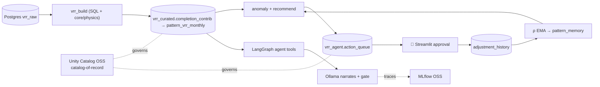

# vrr_agent_open — design & feasibility

An **all open-source, all-local** port of the Databricks VRR Reasoning & Lineage agent.
Same trust model — *the LLM never computes; every number comes from a deterministic
tool with provenance; a faithfulness gate rejects unsupported narration; recommendations
are physics-computed and safety-clamped; humans approve; outcomes feed a learned ρ* —
rebuilt on a free, local stack.

## Component map (Databricks → OSS)

| Concern | Databricks | vrr_agent_open (OSS) |
|---|---|---|
| Data + compute | Spark / SQL warehouse | **PostgreSQL** (VRR is pure SQL) + psycopg |
| Governance | Unity Catalog (managed) | **Unity Catalog OSS** — catalog-of-record |
| Agent loop | Mosaic AI ChatAgent | **LangGraph** (tool nodes + gate node) |
| Tracing / eval / registry | MLflow (managed) | **MLflow OSS** (local server, Postgres backend) |
| Vector index | Vector Search | **pgvector** (same Postgres) |
| Serving | Model Serving endpoint | **FastAPI/LangServe** or in-process |
| UI | Databricks Apps | **Streamlit** (local) |
| Packaging/deploy | DAB bundle | **docker-compose** + `pip install -e .` |
| LLM narrator | claude-sonnet-5 (in-workspace) | **Ollama** local (pluggable) |

## Feasibility: "Unity Catalog on top of PostgreSQL"

**Verdict: feasible as a *catalog-of-record*, not as a query-enforcement layer.**

Unity Catalog OSS (github.com/unitycatalog/unitycatalog, Apache-2.0) is a real,
runnable governance server — but it is a **catalog** (metadata + RBAC + lineage +
credential vending), **not a query engine**. Two consequences:

1. **It governs registered assets, it doesn't intercept Postgres queries.** Querying
   live Postgres *through* UC (Lakehouse Federation) is a Databricks-proprietary
   feature, absent from OSS. So UC OSS won't enforce row/column policy on a raw
   `psycopg` query.
2. **Its own metastore backend can be Postgres** — so the same Postgres instance
   holds both the VRR data *and* UC's catalog metadata.

**Design chosen:** Postgres is data + compute; UC OSS is the **catalog-of-record** —
it holds the governed schema/table/function inventory, RBAC grants, and lineage
metadata. The agent resolves object names + permission from UC, *then* executes
against Postgres. Governance = catalog + access decisions + lineage (auditable,
declarative — mirrors the Databricks "declared resources" model), just without
in-query enforcement. If you later want true enforcement, put a thin policy check
(read grants from UC) in the tools layer before each Postgres call.

Alternative (not chosen): all-Delta data governed natively by UC + DuckDB engine —
cleaner UC semantics but drops the "run VRR in Postgres" goal.

## What ports verbatim (provider-agnostic, already tested)

`core/physics.py`, `core/recommend.py`, `core/anomaly.py`, `core/knowledge.py`,
`core/approval.py` are pure Python with **no Databricks/Spark dependency** — copied
unchanged, with their unit tests. That's the deterministic heart of the system: PVT
ladder, ρ-calibrated safety-clamped recommendation, anomaly rules + input veto, PII
redaction, and the approval state machine. The only rewrites are the I/O edges:
tools over psycopg (was Spark), the LangGraph loop (was ChatAgent), and governance
registration (UC OSS REST, was DAB resources).

## Data flow (unchanged in spirit)

## Build order
1. `docker compose up -d` → Postgres+pgvector, Unity Catalog OSS, MLflow.
2. `make seed` → synthetic raw + curated (core/physics computes curated).
3. `make register` → schemas/tables in UC OSS.
4. `make test` → the ported pure-logic tests (no stack needed).
5. `make agent` / `make app` → ask questions; approve drafts.

## Status
Scaffold + verbatim core + schema + LangGraph/tools/app/governance skeletons.
TODO (marked in code): port `vrr_decompose` SQL, wire the faithfulness gate into the
graph, the Postgres `vrr_build` runner, pgvector ingest, and the UC policy check.
