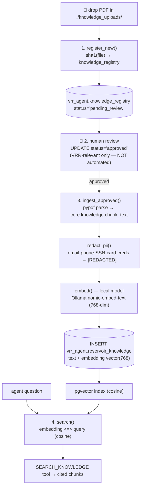

# PDF → vector DB (pgvector) — knowledge ingestion flow

How reservoir PDFs become searchable semantic memory, fully local (no cloud vector
service). Code: [pipeline/knowledge_ingest.py](../src/vrr_agent_open/pipeline/knowledge_ingest.py)
+ pure text ops in [core/knowledge.py](../src/vrr_agent_open/core/knowledge.py).



## The four steps

| Step | Function | What happens |
|---|---|---|
| 1. Register | `register_new()` | Every new PDF in `./knowledge_uploads/` gets a `knowledge_registry` row, `status='pending_review'`. Nothing else touches it. |
| 2. Review | *(human SQL)* | A reviewer confirms it's VRR-relevant and sets `status='approved'`. **Deliberately manual** — relevance is not automated (guardrail). |
| 3. Ingest | `ingest_approved()` | Parse (pypdf) → **chunk** (paragraph-aware + overlap) → **PII detect & REDACT** (PII never reaches the DB) → **embed** with a local model → `INSERT` into `reservoir_knowledge` with the `vector(768)` embedding. |
| 4. Search | `search()` | The agent's `SEARCH_KNOWLEDGE` tool runs `embedding <=> query` (pgvector cosine `<=>`), returns the top-k cited chunks. |

## Why pgvector (vs a separate vector service)

- **Same database** as the VRR data — one store, one backup, one connection; no
  extra service, no cost. The embedding lives in `vrr_agent.reservoir_knowledge`
  next to the governed tables.
- **Cosine search** is `ORDER BY embedding <=> query LIMIT k` — plain SQL.
- Add an ANN index for scale: `CREATE INDEX ON vrr_agent.reservoir_knowledge
  USING hnsw (embedding vector_cosine_ops);`

## Guardrails preserved from the Databricks version

- **Human relevance gate** before anything is embedded (step 2).
- **PII redacted before storage** — the raw match never lands in the DB or index.
- **Every retrieved chunk is citable** (file_name + page), so the agent grounds
  knowledge claims the same way it grounds numbers.

## Run it

```bash
# local embedding model (once):  ollama pull nomic-embed-text
mkdir -p knowledge_uploads && cp your_report.pdf knowledge_uploads/
python -m vrr_agent_open.pipeline.knowledge_ingest      # register + ingest approved
# approve in SQL first:
#   UPDATE vrr_agent.knowledge_registry SET status='approved' WHERE file_name='your_report.pdf';
```
